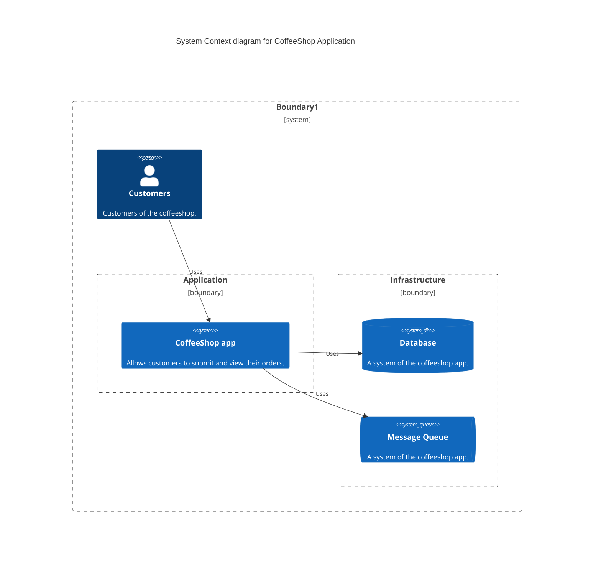
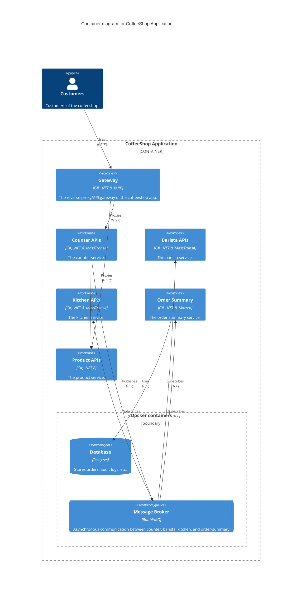

# The Coffeeshop Apps on .NET Aspire

The coffeeshop apps on .NET Aspire


## Introduction

> Notice: This is just a demo of how can we build and deploy the microservices approach. In the reality, the boundary should be defined by bounded-context concepts of Domaim-driven Design, and totally based on the business domain, and might not be so fine-grained services like this demo, so you use it with care.

- [x] Built on .NET 8.0 LTS
- [x] Microservices architectural style
- [x] Follows Vertical Sliding principles
- [x] Domain Driven Design building blocks
- [x] CQRS with MediatR and Fluent Validations
- [x] Shift-left Observability with .NET Aspire (OpenTelemetry built-in)
	- [x] Custom OpenTelemetry for MediatR and FluentValidation handlers
	- [x] Custom OpenTelemetry for MassTransit on consumers
	- [x] Enrich .NET 8 global loggings
- [x] OpenAPI supports
- [x] Mapperly for generating object mappings
- [x] API Versioning
- [x] Integration test with .NET Aspire and Wiremock.NET
	- [x] Run it on GitHub Actions and output code coverage
- [ ] Response Caching - Distributed Caching with Redis
- [ ] Dapr integration
- [ ] JWT & Authentication with Keycloak

## System Context diagram - C4 Model



## Container diagram - C4 Model



## Prerequisites

If you run on `Windows 11`: 

```bash
> cargo install just
# https://cheatography.com/linux-china/cheat-sheets/justfile/
```

## Get starting

```sh
> dotnet build coffeeshop-aspire.sln
> dotnet run --project app-host/app-host.csproj
# http://localhost:5019
```

## Generate manifest file (powershell)

```sh
dotnet run --project app-host\CoffeeShop.AppHost.csproj `
    --publisher manifest `
    --output-path ../aspire-manifest.json
```

## Deploy to Kubernetes

```sh
dotnet tool install -g aspirate --prerelease
```

## Run with Justfile (cross-platform)

```sh
> just run
```

On Windows 11 - WSL2 Ubuntu 22 integrated, we can use `Podman Desktop` to replace `Docker for Desktop`, and run `.NET Aspire` normally. Check this blog post -> https://dev.to/thangchung/net-8-integration-tests-on-podman-desktop-windows-11-wsl2-ubuntu-23-4hpo

## Run with Makefile (Ubuntu)

```sh
> touch .env
> make run
# http://localhost:5019
```

```sh
dotnet publish "/workspaces/coffeeshop-aspire/app-host/../product-api/CoffeeShop.ProductApi.csproj" -p:PublishProfile="DefaultContainer" -p:PublishSingleFile="true" 
-p:PublishTrimmed="false" --self-contained "true" --verbosity "quiet" --nologo -r "linux-x64" -p:ContainerRegistry="k3d-myregistry.localhost:12345" -p:ContainerRepository="product-api" -p:ContainerImageTag="latest"
```
